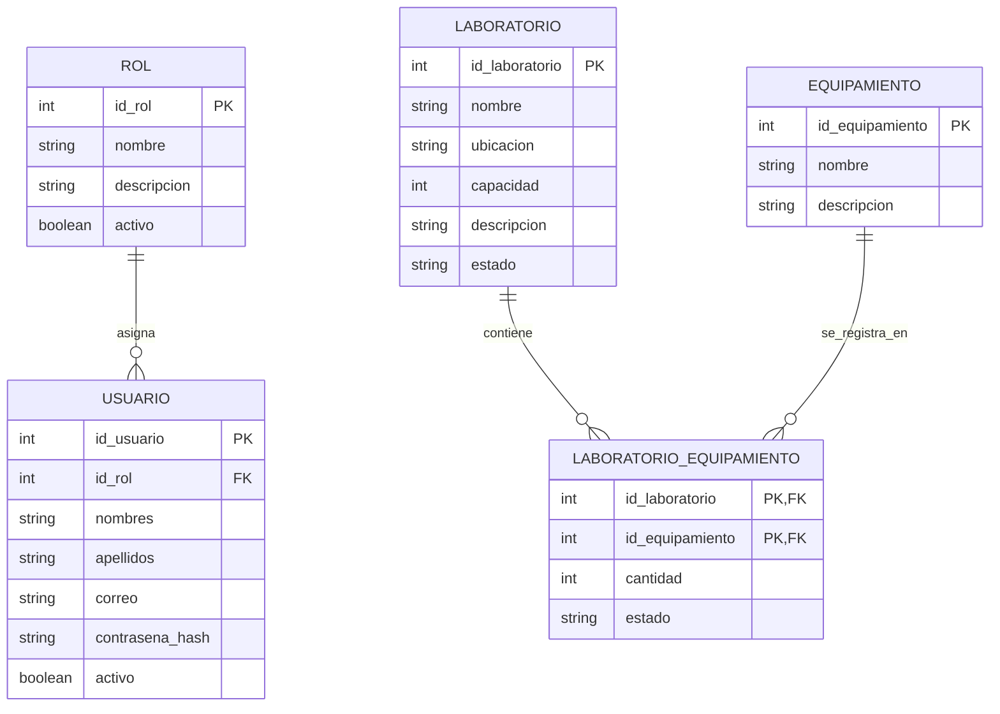

# Borrador del Modelo Entidad-Relación

> **Estado:** Borrador inicial para revisión del docente.  
> El modelo puede modificarse de acuerdo con las observaciones recibidas.

## Alcance de este avance

Este avance comprende el módulo de usuarios y el catálogo de laboratorios. La parte relacionada con reservas, horarios y disponibilidad será integrada posteriormente con el módulo desarrollado por el otro integrante encargado.

## Diagrama ER preliminar

## Descripción de las entidades

### ROL

Almacena los diferentes roles que pueden tener los usuarios del sistema, como estudiante, docente, responsable de laboratorio o administrador.

### USUARIO

Almacena la información de las personas que utilizarán el sistema. Cada usuario tendrá asignado un rol que determinará sus permisos.

### LABORATORIO

Registra la información de cada laboratorio, incluyendo su nombre, ubicación, capacidad y estado.

### EQUIPAMIENTO

Contiene el catálogo de los diferentes tipos de equipamiento disponibles, como computadoras, proyectores y otros recursos.

### LABORATORIO_EQUIPAMIENTO

Relaciona los laboratorios con sus equipamientos. También permite registrar la cantidad y el estado del equipamiento disponible en cada laboratorio.

## Relaciones preliminares

- Un rol puede estar asignado a varios usuarios.
- Cada usuario debe tener un solo rol.
- Un laboratorio puede tener diferentes tipos de equipamiento.
- Un tipo de equipamiento puede encontrarse en varios laboratorios.
- `LABORATORIO_EQUIPAMIENTO` resuelve la relación de muchos a muchos entre laboratorios y equipamientos.

## Roles propuestos

- Estudiante
- Docente o auxiliar
- Responsable de laboratorio
- Administrador

## Aspectos pendientes de revisión

- Definir qué usuarios podrán solicitar reservas.
- Definir los estados permitidos para los laboratorios y equipamientos.
- Revisar los atributos propuestos con el docente.
- Integrar este módulo con las entidades de reservas y horarios.
- Confirmar las relaciones y cardinalidades.
- Agregar restricciones y validaciones en una siguiente entrega.